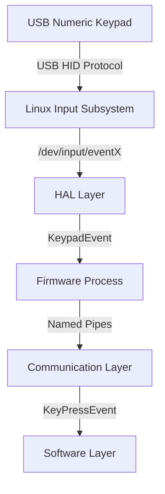
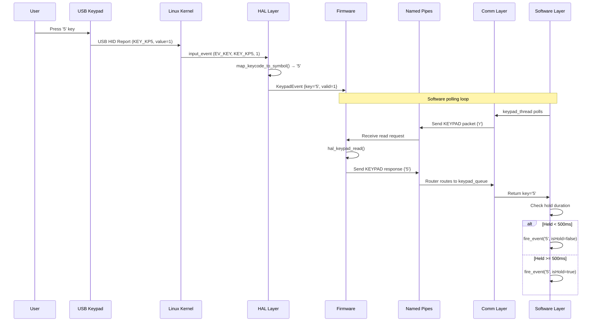

# Key Mapping Process

This document provides a complete explanation of how keypad input flows through the HAMPOD system, from the moment a physical key is pressed on the USB numeric keypad to the point where the Software layer processes the event.

## Overview

The HAMPOD keypad system follows a layered architecture:



---

## Layer 1: Hardware — USB Numeric Keypad

### Physical Key Press

When a user presses a key on the USB numeric keypad:

1. **Mechanical Action**: The key switch closes a circuit
2. **Keypad Controller**: The onboard microcontroller in the keypad detects the key matrix position
3. **USB HID Report**: The keypad sends a USB Human Interface Device (HID) report containing:
   - Keycode (e.g., `KEY_KP0` for numpad 0)
   - Key state (press, release, or repeat)

### Keypad Layout

The HAMPOD uses a 16-key numeric keypad with this layout:

```
┌─────┬─────┬─────┬─────┐
│  1  │  2  │  3  │  A  │  (A = / key)
├─────┼─────┼─────┼─────┤
│  4  │  5  │  6  │  B  │  (B = * key)
├─────┼─────┼─────┼─────┤
│  7  │  8  │  9  │  C  │  (C = - key)
├─────┼─────┼─────┼─────┤
│  *  │  0  │  #  │  D  │  (D = + key)
└─────┴─────┴─────┴─────┘
```

---

## Layer 2: Linux Input Subsystem — Key Repeat Behavior

### USB HID to Linux Events

When the USB keypad is connected to the Raspberry Pi (running Debian Linux):

1. **Driver Loading**: The kernel loads the `usbhid` driver
2. **Device Node Creation**: Linux creates `/dev/input/eventX` for the keypad
3. **Input Event Generation**: The kernel translates USB HID reports into `input_event` structures

### Linux Key Repeat (Autorepeat)

Linux's input subsystem has built-in key repeat functionality controlled by:

- **Delay**: Initial pause before repeat starts (typically 250-500ms)
- **Rate**: How fast keys repeat once started (typically 30-60 Hz)

These are controlled via sysfs or `xset r rate` on X11 systems.

#### Event Values

The `input_event.value` field indicates the event type:

| Value | Meaning              | Description                                      |
|-------|----------------------|--------------------------------------------------|
| `0`   | Key Release          | Key was released                                 |
| `1`   | Key Press            | Key was initially pressed                        |
| `2`   | Key Repeat (Autorepeat) | Key is being held and Linux is auto-repeating |

> [!IMPORTANT]
> The HAL layer (not the Software layer) is responsible for interpreting `ev.value == 2` repeat events from the kernel.

### Relevant Code: HAL Keypad Read

From [hal_keypad_usb.c](file:///c:/Users/wayne/github/hampod/HAMPOD2026/Firmware/hal/hal_keypad_usb.c#L136-L207):

```c
if (ev.value == 1) {        /* Key press down */
    // ... handle initial press
    
} else if (ev.value == 0) { /* Key release */
    // Clear hold state if this release matches held key
    
} else if (ev.value == 2) { /* Key repeat (held) */
    // Report the held key again
    if (hold_state.held_key != '-') {
        event.raw_code = hold_state.held_code;
        event.key = hold_state.held_key;
        event.valid = 1;
    }
}
```

---

## Layer 3: HAL (Hardware Abstraction Layer) — Keycode Mapping

### Device Discovery

The HAL searches for the USB keypad using glob patterns:

```c
#define KEYPAD_DEVICE_PATTERN "/dev/input/by-id/*-kbd*"
```

### Keycode to Symbol Mapping

The HAL translates Linux keycodes to HAMPOD character symbols:

| Linux Keycode       | HAMPOD Symbol | Physical Key    |
|---------------------|---------------|-----------------|
| `KEY_KP0`           | `'0'`         | Numpad 0        |
| `KEY_KP1`-`KEY_KP9` | `'1'`-`'9'`   | Numpad 1-9      |
| `KEY_KPSLASH`       | `'A'`         | Numpad /        |
| `KEY_KPASTERISK`    | `'B'`         | Numpad *        |
| `KEY_KPMINUS`       | `'C'`         | Numpad -        |
| `KEY_KPPLUS`        | `'D'`         | Numpad +        |
| `KEY_KPENTER`       | `'#'`         | Numpad Enter    |
| `KEY_KPDOT`         | `'*'`         | Numpad . (DEL)  |
| `KEY_NUMLOCK`       | `'X'`         | Num Lock        |
| `KEY_BACKSPACE`     | `'Y'`         | Backspace       |

### KeypadEvent Structure

The HAL returns events in a standardized structure defined in [hal_keypad.h](file:///c:/Users/wayne/github/hampod/HAMPOD2026/Firmware/hal/hal_keypad.h#L19-L23):

```c
typedef struct {
    char key;              // Character: '0'-'9', 'A'-'D', '*', '#', '-'
    int raw_code;          // Original Linux keycode
    unsigned char valid;   // 1 if valid, 0 if invalid/no key
} KeypadEvent;
```

### Special Handling: '00' Key Debouncing

Some USB keypads have a '00' key that sends two rapid `KEY_KP0` events. The HAL debounces this:

```c
/* If within 50ms (50000 microseconds), suppress duplicate '0' */
if (time_diff < 50000) {
    return event;  // Invalid event to suppress duplicate
}
```

---

## Layer 4: Firmware — Process and Pipe Communication

### Firmware Architecture

The Firmware runs as a separate process and handles:

1. **Keypad Reading Thread**: Polls the HAL for key events
2. **Pipe Communication**: Sends key data to Software via named pipes

### Named Pipes

Communication between Firmware and Software uses named pipes:

| Pipe          | Direction          | Purpose                    |
|---------------|--------------------|----------------------------|
| `Firmware_i`  | Software → Firmware | Commands/requests          |
| `Firmware_o`  | Firmware → Software | Responses (including keys) |
| `KEYPAD_I`    | Internal           | Keypad process input       |
| `KEYPAD_O`    | Internal           | Keypad process output      |

### Keypad Request/Response Protocol

When Software requests a key, the Firmware:

1. Receives a KEYPAD packet with `'r'` (read command)
2. Calls `hal_keypad_read()` to get current key state
3. Returns a KEYPAD packet with the key character

From [keypad_firmware.c](file:///c:/Users/wayne/github/hampod/HAMPOD2026/Firmware/keypad_firmware.c#L106-L115):

```c
if (received_packet->data[0] == 'r') {
    KeypadEvent event = hal_keypad_read();
    if (event.valid) {
        read_value = event.key;
    } else {
        read_value = '-'; // No key pressed
    }
}
```

---

## Layer 5: Communication Layer — Binary Packet Protocol

### Packet Structure

Defined in [comm.h](file:///c:/Users/wayne/github/hampod/HAMPOD2026/Software2/include/comm.h):

```c
typedef struct {
    PacketType type;           // PACKET_KEYPAD, PACKET_AUDIO, etc.
    unsigned short data_len;   // Length of data
    unsigned short tag;        // Request/response matching
    unsigned char data[256];   // Payload
} CommPacket;
```

### Router Thread Architecture

The Communication layer uses a background router thread that:

1. **Reads** all incoming packets from Firmware
2. **Routes** packets to type-specific queues (keypad, audio, config)
3. **Signals** waiting threads when data arrives

From [comm.c](file:///c:/Users/wayne/github/hampod/HAMPOD2026/Software2/src/comm.c#L162-L166):

```c
case PACKET_KEYPAD:
    if (response_queue_push(&keypad_queue, &packet) != HAMPOD_OK) {
        LOG_ERROR("Router: Keypad queue full");
    }
    break;
```

### comm_read_keypad() Function

The high-level keypad read function:

1. Sends a keypad request to Firmware
2. Waits on the keypad response queue with timeout
3. Returns the key character

From [comm.c](file:///c:/Users/wayne/github/hampod/HAMPOD2026/Software2/src/comm.c#L414-L454):

```c
int comm_read_keypad(char* key_out) {
    CommPacket request = {
        .type = PACKET_KEYPAD,
        .data_len = 1,
        .tag = packet_tag++,
        .data = {'r'}  // 'r' = read request
    };
    
    comm_send_packet(&request);
    
    CommPacket response;
    int result = comm_wait_keypad_response(&response, timeout);
    
    *key_out = (char)response.data[0];
    return HAMPOD_OK;
}
```

---

## Layer 6: Software Layer — Keypad Module

### Polling and Hold Detection

The Software keypad module runs a background thread that:

1. **Polls** `comm_read_keypad()` at regular intervals (default: 50ms)
2. **Detects holds** by measuring press duration
3. **Fires callbacks** for press/hold events

### Hold Detection Algorithm

From [keypad.c](file:///c:/Users/wayne/github/hampod/HAMPOD2026/Software2/src/keypad.c#L91-L180):

```
1. When key first detected → record time, set hold_event_fired = false
2. While same key reported:
   - If elapsed >= threshold (500ms) → fire HOLD event
3. When key released:
   - If hold not fired and elapsed >= threshold → fire HOLD
   - Else → fire PRESS
```

### Debouncing for Key Repeat Gaps

Linux key repeat has gaps between events. The Software handles this:

```c
static const int RELEASE_THRESHOLD = 6;  /* 6 polls × 50ms = 300ms */
int no_key_count = 0;

// ... in the polling loop:
if (!key_pressed) {
    no_key_count++;
    if (no_key_count >= RELEASE_THRESHOLD) {
        // Now consider key truly released
        fire_event(last_key, is_hold);
    }
}
```

### KeyPressEvent Structure

The final event passed to application callbacks:

```c
typedef struct {
    char key;         // '0'-'9', 'A'-'D', '*', '#'
    int shiftAmount;  // Reserved for future
    bool isHold;      // true if long press
} KeyPressEvent;
```

---

## Complete Signal Flow Diagram



---

## Configuration Options

### Software Layer

| Setting              | Default | Description                              |
|----------------------|---------|------------------------------------------|
| `hold_threshold_ms`  | 500     | Time before press becomes hold           |
| `poll_interval_ms`   | 50      | How often to poll Firmware               |
| `RELEASE_THRESHOLD`  | 6       | Polls with no key before release (300ms) |

### HAL Layer

| Setting              | Value   | Description                              |
|----------------------|---------|------------------------------------------|
| Debounce window      | 50ms    | Suppress duplicate '00' key presses      |

---

## Error Handling

### HAL Errors

- **Device not found**: Returns `KeypadEvent.valid = 0`
- **Read failure**: Returns invalid event

### Communication Errors

- **Pipe timeout**: `COMM_KEYPAD_TIMEOUT_MS` (configurable)
- **Queue full**: Drops oldest packet, logs error

### Software Errors

- **Callback failure**: Logged, continues polling
- **Thread exit**: `keypad_shutdown()` joins thread

---

## Related Files

| Layer         | File                                                                                             |
|---------------|--------------------------------------------------------------------------------------------------|
| HAL Header    | [hal_keypad.h](file:///c:/Users/wayne/github/hampod/HAMPOD2026/Firmware/hal/hal_keypad.h)        |
| HAL USB Impl  | [hal_keypad_usb.c](file:///c:/Users/wayne/github/hampod/HAMPOD2026/Firmware/hal/hal_keypad_usb.c)|
| Firmware      | [keypad_firmware.c](file:///c:/Users/wayne/github/hampod/HAMPOD2026/Firmware/keypad_firmware.c)  |
| Communication | [comm.c](file:///c:/Users/wayne/github/hampod/HAMPOD2026/Software2/src/comm.c)                   |
| Software      | [keypad.c](file:///c:/Users/wayne/github/hampod/HAMPOD2026/Software2/src/keypad.c)               |
| Software Header | [keypad.h](file:///c:/Users/wayne/github/hampod/HAMPOD2026/Software2/include/keypad.h)         |

---

## Key Mapping Quick Reference

| Physical Key | Linux Keycode       | HAMPOD Symbol | Original HamPod Function       |
|--------------|---------------------|---------------|--------------------------------|
| 0-9          | `KEY_KP0`-`KEY_KP9` | `'0'`-`'9'`   | Numeric input, frequency entry |
| /            | `KEY_KPSLASH`       | `'A'`         | SHIFT function                 |
| *            | `KEY_KPASTERISK`    | `'B'`         | Band/Set                       |
| -            | `KEY_KPMINUS`       | `'C'`         | Announcements toggle           |
| +            | `KEY_KPPLUS`        | `'D'`         | Verbosity toggle               |
| Enter        | `KEY_KPENTER`       | `'#'`         | Enter/Confirm                  |
| . (DEL)      | `KEY_KPDOT`         | `'*'`         | S-Meter, Cancel                |
| Num Lock     | `KEY_NUMLOCK`       | `'X'`         | Special function               |
| Backspace    | `KEY_BACKSPACE`     | `'Y'`         | Special function               |

---

*Last updated: December 2025*
