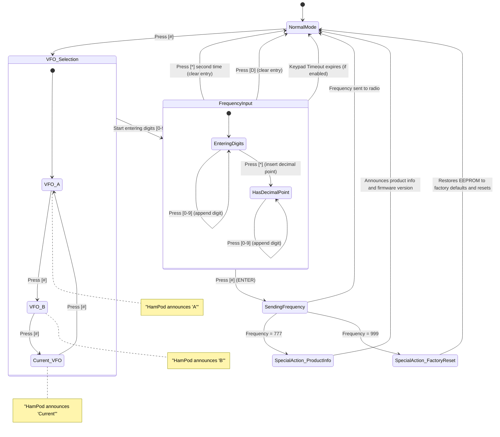
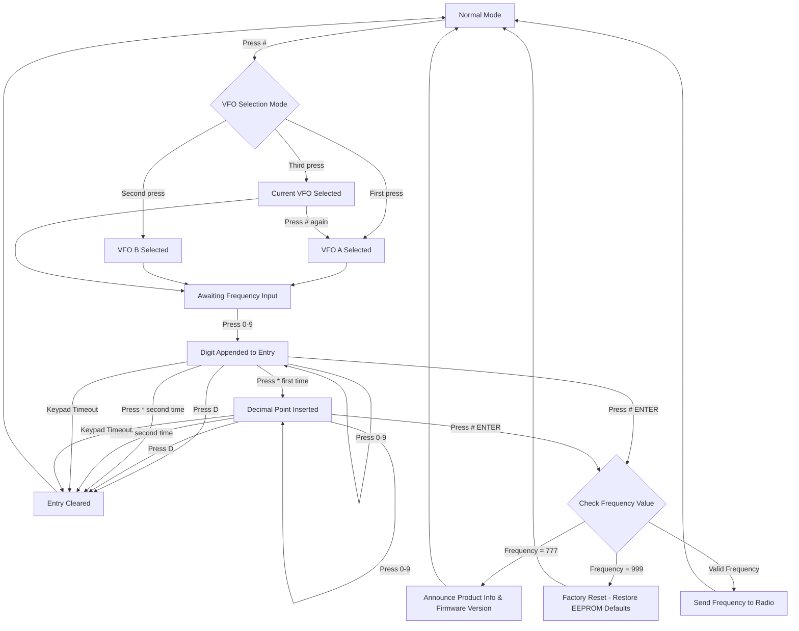
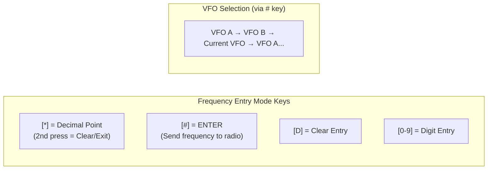
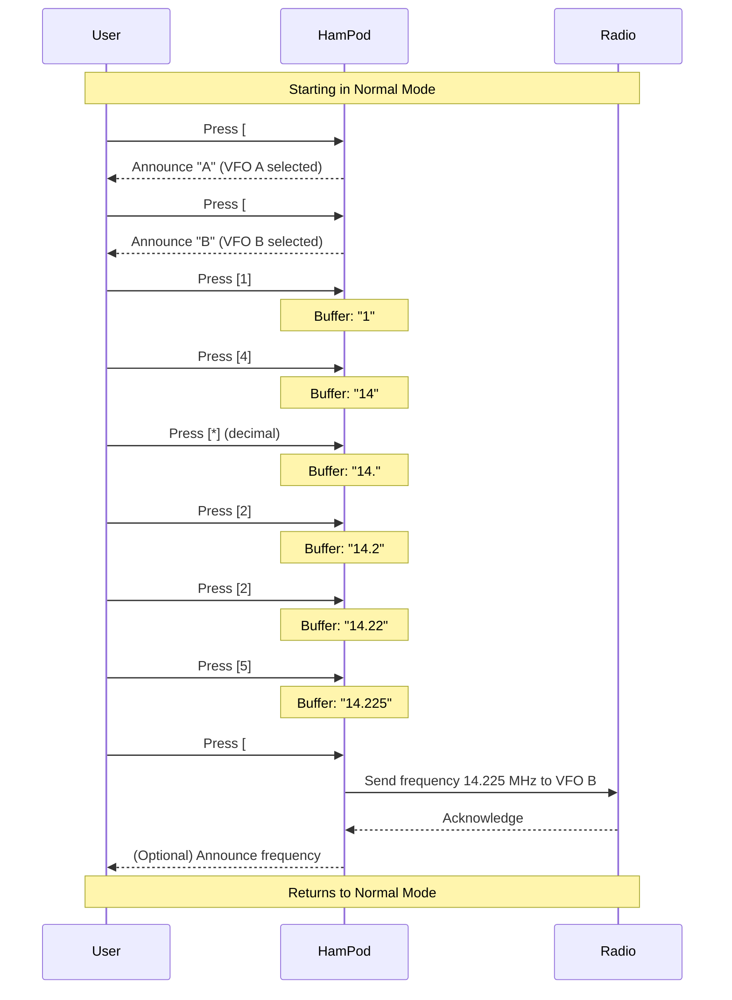
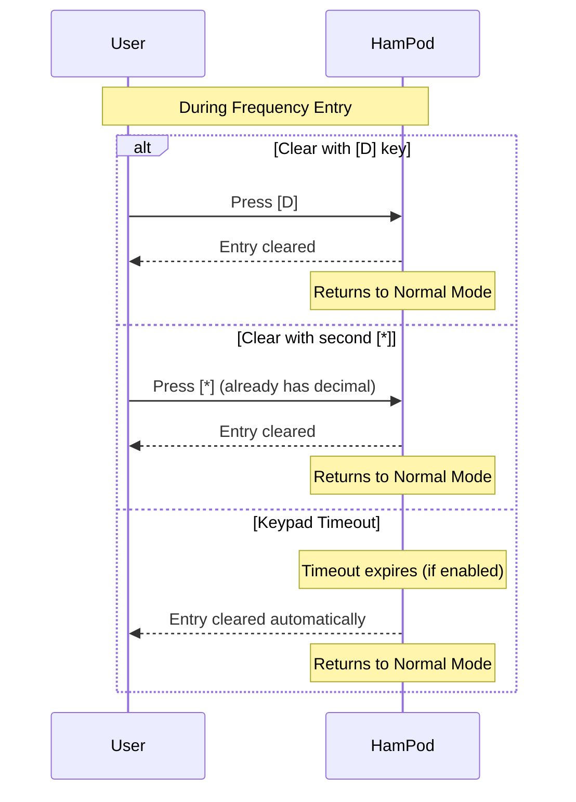
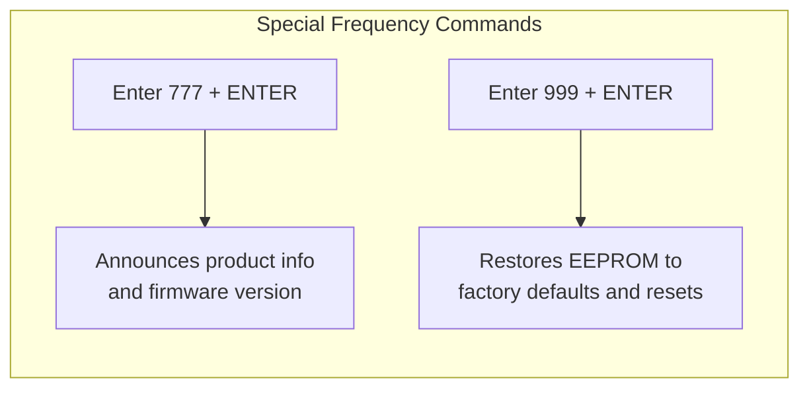
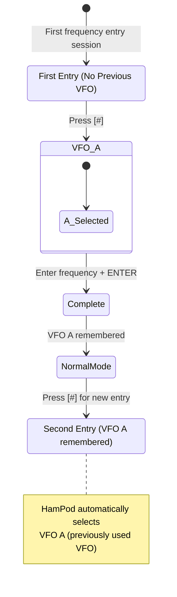

# Frequency Entry Mode - User Interface Behavior

This document defines the expected behavior for Frequency Entry Mode as specified in the **ICOMReader_Manual_v106.txt**.

## State Machine Diagram

## Flowchart - Frequency Entry Process

## Key Mappings in Frequency Entry Mode

## Frequency Announcement Behavior

Per the manual:
> "To decrease chatter and increase efficiency when speaking a frequency value, trailing zeros beyond the 1 Kilohertz position are not spoken."

Example: `7.240` is spoken as **"seven point two four zero"** instead of "seven point two four zero dot zero zero zero"

> "The second decimal point if present, is spoken as 'dot' instead of 'point'. This also helps to better comprehend the frequency being announced."

## Sequence Diagram - Complete Frequency Entry

## Sequence Diagram - Clear/Cancel Entry

## Special Frequencies

## Previous VFO Memory Behavior

> "If you have previously entered a frequency, the same VFO will again be the selected VFO for this new entry."

---

## Source Reference

All behavior documented above is derived from **ICOMReader_Manual_v106.txt**, specifically:
- Section **2. FREQUENCY ENTRY MODE** (Lines 165-180)
- Key references in **APPENDIX A** (Lines 520-634)

---

## 🚧 TODOs - Gaps Requiring Clarification Before Implementation

The following items are **NOT specified in the manual** and would require guessing during implementation. Each must be resolved before this specification is complete.

### 1. Audio/Speech Feedback Gaps

| Gap          | Question                                                                                                                        | Manual Reference | Answer |
| ------------ | ------------------------------------------------------------------------------------------------------------------------------- | ---------------- | ------ |
| **TODO-1.1** | What audio feedback (if any) is given when each digit is pressed? (Beep? Spoken digit? Nothing?)                                | Not specified    |        |
| **TODO-1.2** | What audio feedback is given when the decimal point `[*]` is pressed?                                                           | Not specified    |        |
| **TODO-1.3** | What audio feedback is given when entry is cleared via `[D]` or second `[*]`? (Beep? "Cleared"?)                                | Not specified    |        |
| **TODO-1.4** | What audio feedback is given on keypad timeout?                                                                                 | Not specified    |        |
| **TODO-1.5** | After frequency is sent to radio, is there confirmation speech? The sequence diagram says "(Optional)" - need definitive answer | Not specified    |        |
| **TODO-1.6** | What audio feedback for invalid frequency entry? (Out of range for radio, malformed, etc.)                                      | Not specified    |        |

### 2. Frequency Format & Validation Gaps

| Gap           | Question                                                                                  | Manual Reference          | Answer |
| ------------- | ----------------------------------------------------------------------------------------- | ------------------------- | ------ |
| **TODO-2.1**  | What is the frequency unit? MHz assumed, but not explicitly stated for entry              | Implied MHz from examples |        |
| **TODO-2.2**  | What is the maximum number of digits allowed before the decimal point?                    | Not specified             |        |
| **TODO-2.3**  | What is the maximum number of digits allowed after the decimal point?                     | Not specified             |        |
| **TODO-2.4**  | What is the total maximum buffer size for frequency entry?                                | Not specified             |        |
| **TODO-2.5**  | Are leading zeros allowed/handled? (e.g., `07.000` vs `7.000`)                            | Not specified             |        |
| **TODO-2.6**  | What happens if user presses `[#]` (ENTER) with NO digits entered?                        | Not specified             |        |
| **TODO-2.7**  | What happens if user enters only a decimal point and presses ENTER? (e.g., `.` or `14.`)  | Not specified             |        |
| **TODO-2.8**  | What happens if user presses `[*]` BEFORE entering any digits?                            | Not specified             |        |
| **TODO-2.9**  | Is there frequency range validation before sending to radio? Or is the radio responsible? | Not specified             |        |
| **TODO-2.10** | How is an entry of "0" handled? Is it valid?                                              | Not specified             |        |

### 3. VFO Selection State Gaps

| Gap | Question | Manual Reference | Answer |
|-----|----------|------------------|--------|
| **TODO-3.1** | If user starts with `[#]` and presses VFO cycle 3 times (back to A), can they still enter frequency? Or does VFO cycling continue indefinitely until digit pressed? | Not specified | |
| **TODO-3.2** | What is "Current VFO"? Is it whichever VFO was last active on the radio? | Implied but not defined | |
| **TODO-3.3** | After VFO selection, is there a timeout if no digits are pressed? Or does it wait indefinitely? | Not specified (keypad timeout may apply?) | |
| **TODO-3.4** | Can user press `[D]` or `[*]` to cancel during VFO selection (before any digits)? | Not specified | |

### 4. Key Behavior Edge Cases

| Gap | Question | Manual Reference | Answer |
|-----|----------|------------------|--------|
| **TODO-4.1** | What do keys `[A]`, `[B]`, `[C]` do in Frequency Entry Mode? Ignored? Error beep? | Not specified | |
| **TODO-4.2** | What does `[SHIFT]` (`[A]`) do in Frequency Entry Mode? | Not specified | |
| **TODO-4.3** | What does `[D] Hold` do in Frequency Entry Mode? | Not specified | |
| **TODO-4.4** | Can you press `[*]` multiple times before it counts as "second press"? (e.g., `14.*` then `[*]` again) | Unclear | |
| **TODO-4.5** | If buffer already has decimal, does pressing `[*]` immediately clear, or is there any confirmation? | Not specified | |

### 5. Keypad Timeout Behavior

| Gap | Question | Manual Reference | Answer |
|-----|----------|------------------|--------|
| **TODO-5.1** | Does the timeout timer reset with each keypress? | Implied but not stated | |
| **TODO-5.2** | What is the exact timeout range? (Manual says 5-30 seconds in config, but which value is used?) | Config option 5-30s, default not specified | |
| **TODO-5.3** | Does timeout apply during VFO selection phase, or only after digits have been entered? | Not specified | |
| **TODO-5.4** | Is there audio warning before timeout occurs? | Not specified | |

### 6. Previous VFO Memory Behavior

| Gap | Question | Manual Reference | Answer |
|-----|----------|------------------|--------|
| **TODO-6.1** | Is the "remembered VFO" announcement immediate? (e.g., "A" spoken automatically?) | Not specified | |
| **TODO-6.2** | Is remembered VFO stored in EEPROM (persists across power cycles) or RAM only? | Not specified | |
| **TODO-6.3** | What is the default VFO on first-ever frequency entry? (A assumed but not stated) | Not specified | |

### 7. Radio Communication Gaps

| Gap | Question | Manual Reference | Answer |
|-----|----------|------------------|--------|
| **TODO-7.1** | What happens if the radio does not acknowledge the frequency command? | Not specified | |
| **TODO-7.2** | What happens if the radio is disconnected during frequency entry? | Not specified | |
| **TODO-7.3** | Is the frequency entry stored in HamPod's "internal memory" immediately on ENTER, or only after radio confirms? (See `[SHIFT]+[#]` recall feature) | Implied after send | |
| **TODO-7.4** | What CI-V command format is used to send frequency to the radio? | Not in user manual (implementation detail) | |

### 8. Special Frequencies (777/999)

| Gap | Question | Manual Reference | Answer |
|-----|----------|------------------|--------|
| **TODO-8.1** | For 777: Exactly what product/firmware info is announced? Format? | "Product information and firmware version" - vague | |
| **TODO-8.2** | For 999: Is there any confirmation prompt before factory reset? | "Will restore... and perform a reset" - no confirmation mentioned | |
| **TODO-8.3** | For 999: Does this require a specific VFO to be selected, or works with any? | Not specified | |
| **TODO-8.4** | Are there other undocumented special frequencies? | Unknown | |

### 9. Mode Interaction Gaps

| Gap | Question | Manual Reference | Answer |
|-----|----------|------------------|--------|
| **TODO-9.1** | Can Frequency Entry Mode be entered from modes other than Normal Mode? | Not specified | |
| **TODO-9.2** | What happens if user is in Config Mode and presses `[#]`? | Not specified | |
| **TODO-9.3** | During frequency entry, can you switch serial ports with `[D] Hold`? | Conflict with [D] = clear | |

---

## Priority TODO Summary

### Critical (Must Know Before Implementation)

1. **TODO-2.6**: What happens with ENTER on empty buffer?
2. **TODO-2.2/2.3/2.4**: Buffer size limits
3. **TODO-1.1**: Audio feedback on digit entry
4. **TODO-4.1**: Behavior of unused keys (A, B, C)
5. **TODO-7.1**: Radio non-response handling

### Important (Affects UX but could use reasonable defaults)

6. **TODO-5.1/5.2**: Timeout timer behavior
7. **TODO-1.3/1.4**: Cancel/timeout audio feedback
8. **TODO-6.2**: VFO memory persistence

### Nice to Have (Edge cases)

9. **TODO-2.5**: Leading zero handling
10. **TODO-8.4**: Undocumented special frequencies
