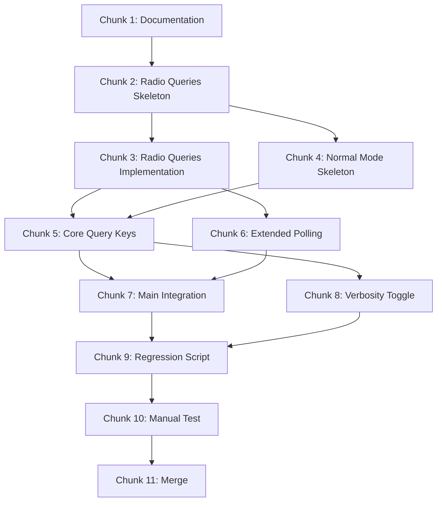

# Phase 2: Normal Mode Implementation Plan

## Overview

This plan implements **Normal Mode** - the primary operating mode where the user can query radio status and receive automatic announcements of changes. Based on [ICOMReader_Manual_v106.txt](../Original_Hampod_Docs/ICOMReader_Manual_v106.txt) section 1.

### Prerequisites (Complete)

- ✅ Phase 0: Core Infrastructure (comm, speech, keypad, config)
- ✅ Phase 1: Frequency Mode (radio module, frequency entry, polling)

### Goals

1. **Query Functions** - User can press keys to hear radio status
2. **Automatic Announcements** - Changes detected via polling are announced
3. **Modular Design** - Break the 1016-line switch statement into manageable handlers

---

## Target Key Bindings (Phase 2 Scope)

From the ICOMReader manual, Normal Mode has ~50 key combinations. For Phase 2, we implement the **core subset**:

### Core Query Keys (No Shift)

| Key | Press | Hold |
|-----|-------|------|
| `[1]` | Select VFO A, announce freq | Select VFO B, announce freq |
| `[2]` | Announce current frequency | (Phase 3) |
| `[0]` | Read current mode (USB/LSB/CW/etc) | (Phase 3) |
| `[*]` | Read S-meter | Read RF power meter |

### Automatic Announcements

| Event | Behavior |
|-------|----------|
| Frequency change | Announce after 1-second debounce (existing) |
| Mode change | Announce immediately (no debounce needed) |
| VFO change | Announce VFO name immediately when switched |

> [!NOTE]
> The `[C]` key toggles automatic frequency announcements on/off (verbosity control). This will be implemented in Phase 2.

---

## Architecture

### Code Structure

```
Software2/
├── src/
│   ├── normal_mode.c      # Main dispatcher, state management
│   └── radio_queries.c    # Extended radio query functions (mode, VFO, meter)
├── include/
│   ├── normal_mode.h      # Normal mode API
│   └── radio_queries.h    # Query function declarations
└── tests/
    ├── test_normal_mode.c # Unit tests with mocks
    └── test_radio_queries.c # Integration tests
```

### Radio Module Extensions

The existing `radio.c` handles frequency only. We need to add:

```c
// radio_queries.h - New file
const char* radio_get_mode(void);           // "USB", "LSB", "CW", etc.
int radio_set_vfo(int vfo);                 // VFO_A=0, VFO_B=1, VFO_CURR=2
int radio_get_vfo(void);                    // Returns current VFO selection
double radio_get_smeter(void);              // S-meter reading (0.0-1.0)
double radio_get_power_meter(void);         // RF power reading (0.0-1.0)
```

### Polling Extension

The existing polling thread monitors frequency. Extend it to also detect:
- Mode changes (USB → LSB, etc.)
- VFO changes (A ↔ B)

Use a generalized callback structure:

```c
typedef struct {
    double frequency;
    int mode;        // rmode_t from Hamlib
    int vfo;         // vfo_t from Hamlib
} RadioState;

typedef void (*radio_state_change_callback)(const RadioState* old_state, const RadioState* new_state);
```

---

## Implementation Chunks

### Chunk 1: Documentation & Branch (Est: 5 min)

**Files:**
- [x] Create `fresh-start-phase-2-plan.md` (this file)
- [ ] Create feature branch `feature/normal-mode`
- [ ] Update `fresh-start-big-plan.md` with Phase 2 status

**Test:** N/A (documentation only)

---

### Chunk 2: Radio Queries Module Skeleton (Est: 20 min)

**New Files:**
- `Software2/include/radio_queries.h` - API declarations
- `Software2/src/radio_queries.c` - Stub implementations returning dummy values

**API:**

```c
// Mode operations
const char* radio_get_mode_string(void);  // Returns "USB", "LSB", etc.
int radio_get_mode_raw(void);             // Returns Hamlib rmode_t

// VFO operations  
int radio_get_vfo(void);                  // 0=A, 1=B, 2=CURR
int radio_set_vfo(int vfo);               // Switch VFO
const char* radio_get_vfo_string(void);   // Returns "VFO A", "VFO B"

// Meter operations
double radio_get_smeter(void);            // 0.0-1.0, -1.0 on error
double radio_get_power_meter(void);       // 0.0-1.0, -1.0 on error
```

**Test:** Compile with `make` - should build with stubs.

---

### Chunk 3: Radio Queries Implementation (Est: 30 min)

**Implement Hamlib calls:**

Reference the old `HamlibGetFunctions.c` for:
- `get_current_mode()` → `rig_get_mode()`
- `get_current_vfo()` → `rig_get_vfo()`
- `get_level()` → `rig_get_level()` with `RIG_LEVEL_STRENGTH` for S-meter

**Makefile Update:**
- Add `radio_queries.c` to build

**Test:** Create `test_radio_queries.c` that connects to radio and verifies:
- Mode string is valid (e.g., "USB", "LSB", "CW", "FM", "AM")
- VFO returns 0, 1, or 2
- S-meter returns value >= 0.0 or -1.0 on error

---

### Chunk 4: Normal Mode Skeleton (Est: 20 min)

**New Files:**
- `Software2/include/normal_mode.h` - API
- `Software2/src/normal_mode.c` - Skeleton

**API:**

```c
// Initialization
void normal_mode_init(void);

// Key handler - returns true if key consumed
bool normal_mode_handle_key(char key, bool is_hold);

// Auto-announcement control
void normal_mode_set_verbosity(bool enabled);
bool normal_mode_get_verbosity(void);
```

**Test:** Compile with `make`.

---

### Chunk 5: Core Query Keys Implementation (Est: 45 min)

**Implement key handlers in `normal_mode.c`:**

```c
// [1] - VFO selection
if (key == '1') {
    if (!is_hold) {
        radio_set_vfo(VFO_A);
        announce_frequency();
    } else {
        radio_set_vfo(VFO_B);
        announce_frequency();
    }
    return true;
}

// [2] - Current frequency
if (key == '2' && !is_hold) {
    announce_frequency();
    return true;
}

// [0] - Current mode
if (key == '0' && !is_hold) {
    const char* mode = radio_get_mode_string();
    speech_say_text(mode);
    return true;
}

// [*] - S-meter / Power meter
if (key == '*') {
    if (!is_hold) {
        announce_smeter();
    } else {
        announce_power_meter();
    }
    return true;
}
```

**Test:** Create `test_normal_mode.c` with mocked radio functions:
- Test that `[1]` switches to VFO A and announces frequency
- Test that `[2]` announces current frequency
- Test that `[0]` announces mode
- Test that `[*]` announces S-meter

---

### Chunk 6: Extended Polling (Est: 30 min)

**Modify `radio.c` polling logic to track:**
- Mode changes (new mode differs from last mode)
- VFO changes (new VFO differs from last VFO)

**Extend callback:**

```c
// Old callback - frequency only
typedef void (*radio_freq_change_callback)(double new_freq);

// New callback - full state
typedef struct {
    double frequency;
    const char* mode;
    int vfo;
} RadioState;

typedef void (*radio_state_change_callback)(
    const RadioState* old_state, 
    const RadioState* new_state,
    bool freq_changed,
    bool mode_changed,
    bool vfo_changed
);
```

**Backward Compatibility:** Keep old `radio_start_polling()` working for frequency mode.

**Test:** Run with radio, verify mode/VFO changes trigger callback.

---

### Chunk 7: Integrate with Main (Est: 20 min)

**Modify `main.c`:**

1. Add normal mode to key handler dispatch:

```c
static void on_keypress(const KeyPressEvent* kp) {
    // Try frequency mode first
    if (frequency_mode_handle_key(kp->key, kp->isHold)) {
        return;
    }
    
    // Try normal mode
    if (normal_mode_handle_key(kp->key, kp->isHold)) {
        return;
    }
    
    // Unhandled key...
}
```

2. Register state change callback:

```c
static void on_radio_change(const RadioState* old, const RadioState* new,
                            bool freq, bool mode, bool vfo) {
    if (freq && !frequency_mode_is_active()) {
        // Existing frequency announcement
    }
    if (mode) {
        speech_say_text(new->mode);
    }
    if (vfo) {
        speech_say_text(radio_get_vfo_string());
    }
}
```

**Test:** Build and run `./bin/hampod`.

---

### Chunk 8: Verbosity Toggle [C] Key (Est: 15 min)

**Implement `[C]` key in normal_mode.c:**

```c
// [C] - Toggle frequency announcement verbosity
if (key == 'C' && !is_hold) {
    bool current = normal_mode_get_verbosity();
    normal_mode_set_verbosity(!current);
    if (!current) {
        speech_say_text("Announcements on");
    } else {
        speech_say_text("Announcements off");
    }
    return true;
}
```

The verbosity flag controls whether automatic frequency announcements happen.

**Test:** Add test case for `[C]` toggle.

---

### Chunk 9: Regression Test Script (Est: 15 min)

**Create:** `Documentation/scripts/Regression_Normal_Mode.sh`

- Build Software2
- Run `test_normal_mode` unit tests
- Run `test_radio_queries` if radio connected
- Report pass/fail

**Test:** Run script, verify all tests pass.

---

### Chunk 10: Manual Integration Test (Est: 30 min)

**Create:** `Documentation/scripts/Regression_Phase_Two_Manual_Test.sh`

Similar to Phase 1 script:
1. Clean up processes/pipes
2. Build Firmware and Software2
3. Start both
4. Provide manual test instructions

**Manual Test Checklist:**

| Test | Expected Result |
|------|-----------------|
| Press `[2]` | Hear current frequency |
| Press `[1]` | Hear "VFO A" and frequency |
| Hold `[1]` | Hear "VFO B" and frequency |
| Press `[0]` | Hear mode (e.g., "USB") |
| Press `[*]` | Hear S-meter (e.g., "S9") |
| Hold `[*]` | Hear power level |
| Press `[C]` | Hear "Announcements off" |
| Turn VFO dial | No announcement (verbosity off) |
| Press `[C]` | Hear "Announcements on" |
| Turn VFO dial | Hear frequency after 1 second |

---

### Chunk 11: Regression Testing & Merge (Est: 20 min)

**Run all regression tests:**
1. `Regression_Frequency_Mode.sh` ✅
2. `Regression_Phase0_Integration.sh` ✅
3. `Regression_HAL_Integration.sh` ✅
4. `Regression_Imitation_Software.sh` ✅
5. `Regression_Normal_Mode.sh` ✅ (new)

**Merge:**
```bash
git checkout main
git merge feature/normal-mode --no-ff
git push
```

---

## Reusable Code from Old Software

| Old File | Function | Reuse |
|----------|----------|-------|
| `HamlibGetFunctions.c` | `get_current_mode()` | Copy Hamlib mode-to-string logic |
| `HamlibGetFunctions.c` | `get_current_vfo()` | Copy VFO detection logic |
| `HamlibGetFunctions.c` | `get_level()` | Copy level reading with `RIG_LEVEL_STRENGTH` |
| `NormalMode.c` | Key mapping | Reference for correct key assignments (do NOT copy giant switch) |

---

## Verification Plan

### Automated Tests

| Test | Description |
|------|-------------|
| `test_radio_queries` | Integration test: connect to radio, read mode/VFO/meter |
| `test_normal_mode` | Unit test: verify key handlers with mocked radio |

### Manual Tests

| Test | Steps | Expected |
|------|-------|----------|
| Mode query | Press `[0]` | Hear current mode (USB, LSB, etc.) |
| VFO select A | Press `[1]` | Radio switches to VFO A, frequency announced |
| VFO select B | Hold `[1]` | Radio switches to VFO B, frequency announced |
| Frequency query | Press `[2]` | Hear current frequency |
| S-meter | Press `[*]` | Hear signal strength |
| Verbosity toggle | Press `[C]` | Toggle announcement state |

---

## Execution Checklist

- [ ] **Chunk 1** Documentation & Branch
- [ ] **Chunk 2** Radio Queries Module Skeleton
- [ ] **Chunk 3** Radio Queries Implementation
- [ ] **Chunk 4** Normal Mode Skeleton
- [ ] **Chunk 5** Core Query Keys Implementation
- [ ] **Chunk 6** Extended Polling
- [ ] **Chunk 7** Integrate with Main
- [ ] **Chunk 8** Verbosity Toggle [C] Key
- [ ] **Chunk 9** Regression Test Script
- [ ] **Chunk 10** Manual Integration Test
- [ ] **Chunk 11** Regression Testing & Merge

---

## Dependencies


