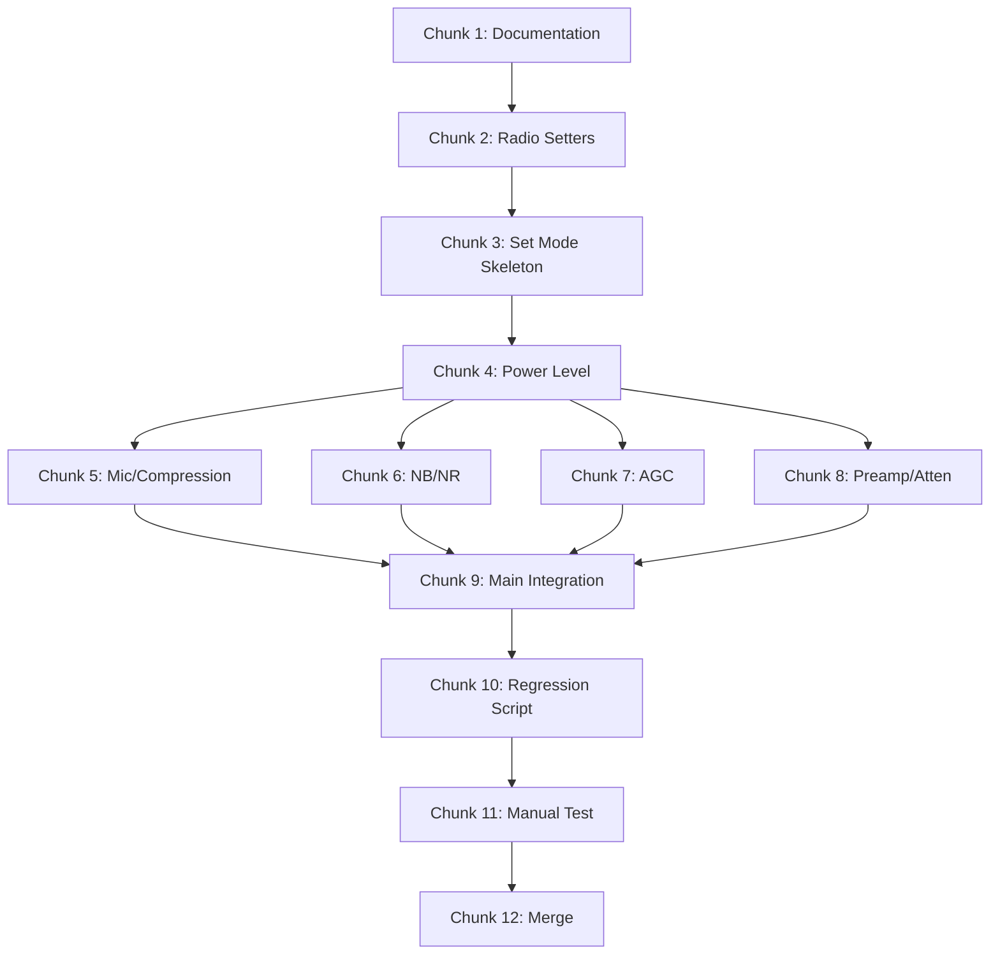

# Phase 3: Set Mode Implementation Plan

## Overview

This plan implements **Set Mode** - the mode where users can adjust radio parameters from the keypad. Based on [ICOMReader_Manual_v106.txt](../Original_Hampod_Docs/ICOMReader_Manual_v106.txt) section 3.

### Prerequisites (Complete)

- ✅ Phase 0: Core Infrastructure (comm, speech, keypad, config)
- ✅ Phase 1: Frequency Mode (radio module, frequency entry)
- ✅ Phase 2: Normal Mode (query functions, auto announcements)

### Goals

1. **Set Mode Toggle** - `[B]` key enters/exits Set Mode
2. **Parameter Adjustment** - Modify radio levels and settings
3. **Value Entry** - Use keypad digits to enter numeric values
4. **Modular Design** - Each parameter group in its own handler

---

## Target Key Bindings (Phase 3 Scope)

Per ICOMReader manual, Set Mode modifies Normal Mode key functions. When Set Mode is active, keys that previously queried now allow modification.

### Core Set Mode Functions

| Key Sequence | Query (Normal Mode) | Set (Set Mode Active) |
|--------------|---------------------|------------------------|
| `[B]` | Enter Set Mode | Exit Set Mode / Toggle |
| `[9]` Hold | Power Level query | Power Level **set** |
| `[8]` Hold | Mic Gain query | Mic Gain **set** |
| `[Shift]+[9]` | Compression query | Compression **set** |
| `[7]` | Noise Blanker query | Noise Blanker **set** |
| `[8]` | Noise Reduction query | Noise Reduction **set** |
| `[4]` | PreAmp query | PreAmp **set** |
| `[Shift]+[4]` | Attenuation query | Attenuation **set** |
| `[4]` Hold | AGC query | AGC **set** |
| `[6]` | Filter Width query | Filter Width **set** |
| `[0]` | Mode query | Mode **cycle** |

### Set Mode Control Keys

| Key | Function |
|-----|----------|
| `[A]` | Increment value / Enable |
| `[B]` | Decrement value / Disable / Exit Set Mode |
| `[C]` | Toggle sub-parameter (e.g., VOX gain vs anti-gain) |
| `[#]` | Confirm and send to radio |
| `[D]` | Cancel and exit Set Mode |
| `[0]-[9]` | Enter numeric value |

---

## Architecture

### Code Structure

```
Software2/
├── src/
│   ├── set_mode.c         # Main Set Mode dispatcher and state
│   ├── radio_setters.c    # Hamlib set functions (power, AGC, etc.)
├── include/
│   ├── set_mode.h         # Set Mode API
│   └── radio_setters.h    # Setter function declarations
└── tests/
    └── test_set_mode.c    # Unit tests
```

### Set Mode State Machine

```
States:
  SET_MODE_OFF       - Not in Set Mode (Normal Mode active)
  SET_MODE_IDLE      - In Set Mode, awaiting parameter selection
  SET_MODE_EDITING   - Editing a specific parameter value
  SET_MODE_CONFIRM   - Value entered, awaiting [#] to confirm

Transitions:
  [B] → SET_MODE_OFF ↔ SET_MODE_IDLE
  Parameter key → SET_MODE_IDLE → SET_MODE_EDITING
  [0-9] → Accumulate value digits
  [#] → Send to radio, return to SET_MODE_IDLE
  [D] → Cancel, return to SET_MODE_IDLE or SET_MODE_OFF
```

### Reusable Code from Old Software

| Old File | Function | Reuse |
|----------|----------|-------|
| `HamlibSetFunctions.c` | `set_level()` | Adapt for power, mic gain, compression, NB, NR, AGC |
| `HamlibSetFunctions.c` | `set_func()` | Adapt for preamp, attenuator toggles |
| `HamlibSetFunctions.c` | `set_mode()` | Adapt for mode cycling |

---

## Implementation Chunks

### Chunk 1: Documentation & Branch (Est: 10 min)

**Files:**
- [x] Create `fresh-start-phase-3-plan.md` (this file)
- [x] Create feature branch `feature/set-mode`
- [x] Update `fresh-start-big-plan.md` with Phase 3 status

**Test:** N/A (documentation only)

---

### Chunk 2: Radio Setters Module (Est: 30 min)

**New Files:**
- `Software2/include/radio_setters.h` - API declarations
- `Software2/src/radio_setters.c` - Hamlib implementations

**API:**

```c
// Power and gain levels (0-100 normalized or radio-specific)
int radio_set_power(int level);        // 0-100%
int radio_set_mic_gain(int level);     // 0-100%
int radio_set_compression(int level);  // 0-100 or 0-10 depending on radio

// Noise controls (toggle + level)
int radio_set_nb(bool enabled, int level);    // Noise Blanker
int radio_set_nr(bool enabled, int level);    // Noise Reduction

// AGC (speed + optional level)
int radio_set_agc(int speed, int level);      // speed: 0=fast, 1=mid, 2=slow

// Preamp and attenuation
int radio_set_preamp(int state);              // 0=off, 1=preamp1, 2=preamp2
int radio_set_attenuation(int db);            // 0=off, or dB value

// Mode cycling
int radio_cycle_mode(void);                   // Cycle to next available mode
```

**Test:** Compile with `make` - should build with stubs.

---

### Chunk 3: Set Mode Skeleton (Est: 20 min)

**New Files:**
- `Software2/include/set_mode.h` - API
- `Software2/src/set_mode.c` - State machine skeleton

**API:**

```c
// Initialization
void set_mode_init(void);

// State queries
bool set_mode_is_active(void);
SetModeState set_mode_get_state(void);

// Key handler - returns true if key consumed
bool set_mode_handle_key(char key, bool is_hold, bool is_shifted);

// Entry/exit
void set_mode_enter(void);
void set_mode_exit(void);
```

**Test:** Compile with `make`.

---

### Chunk 4: Power Level Setting (Est: 45 min)

**Implement first complete Set Mode flow:**

1. `[B]` enters Set Mode → announces "Set Mode"
2. `[9]` Hold selects Power Level → announces current value
3. Keypad digits enter new value (0-100)
4. `[#]` sends to radio → announces "Power set to X"
5. `[B]` or `[D]` exits → announces "Set Mode Off"

**Test:**
- Unit test: State machine transitions
- Manual test: Connect to radio, set power level

---

### Chunk 5: Mic Gain and Compression (Est: 30 min)

**Extend Set Mode:**

- `[8]` Hold → Mic Gain
- `[Shift]+[9]` → Compression

Use same value entry flow as power level.

**Test:** Unit tests for each parameter.

---

### Chunk 6: Noise Blanker and Noise Reduction (Est: 30 min)

**Extend Set Mode:**

- `[7]` → Noise Blanker (toggle + level)
- `[8]` → Noise Reduction (toggle + level)

These require `[A]` to enable, `[B]` to disable, and digits for level.

**Test:** Unit tests for toggle + level combination.

---

### Chunk 7: AGC Settings (Est: 30 min)

**Extend Set Mode:**

- `[4]` Hold → AGC speed and level

Speed selection via `[1]`/`[2]`/`[3]` Hold (Fast/Mid/Slow), then digits for level.

**Test:** Unit tests for speed + level.

---

### Chunk 8: Preamp and Attenuation (Est: 25 min)

**Extend Set Mode:**

- `[4]` → PreAmp state (0/1/2)
- `[Shift]+[4]` → Attenuation dB

**Test:** Unit tests.

---

### Chunk 9: Main Integration (Est: 20 min)

**Modify `main.c`:**

1. Add `set_mode.h` include
2. Add `set_mode_init()` call
3. Modify `on_keypress` to check Set Mode first
4. Pass `is_shifted` flag to handlers

**Key routing order:**
```c
if (set_mode_is_active()) {
    if (set_mode_handle_key(...)) return;
}
if (frequency_mode_handle_key(...)) return;
if (normal_mode_handle_key(...)) return;
```

**Test:** Build and run full system.

---

### Chunk 10: Regression Test Script (Est: 15 min)

**Create:** `Documentation/scripts/Regression_Set_Mode.sh`

- Build Software2
- Run `test_set_mode` unit tests
- Report pass/fail

---

### Chunk 11: Manual Integration Test (Est: 30 min)

**Create:** `Documentation/scripts/Regression_Phase_Three_Manual_Test.sh`

**Manual Test Checklist:**

| Test | Expected |
|------|----------|
| Press `[B]` | Hear "Set Mode" |
| Hold `[9]` | Hear current power level |
| Enter "50" then `[#]` | Hear "Power set to 50" |
| Press `[B]` | Hear "Set Mode Off" |
| Verify radio | Power level changed |

---

### Chunk 12: Regression Testing & Merge (Est: 20 min)

**Run all regression tests:**
1. `Regression_Frequency_Mode.sh` ✅
2. `Regression_Normal_Mode.sh` ✅
3. `Regression_Set_Mode.sh` ✅ (new)
4. `Regression_Phase0_Integration.sh` ✅
5. `Regression_HAL_Integration.sh` ✅

**Merge:**
```bash
git checkout main
git merge feature/set-mode --no-ff
git push
```

---

## Execution Checklist

- [x] **Chunk 1** Documentation & Branch
- [x] **Chunk 2** Radio Setters Module
- [x] **Chunk 3** Set Mode Skeleton
- [x] **Chunk 4** Power Level Setting
- [x] **Chunk 5** Mic Gain and Compression
- [x] **Chunk 6** Noise Blanker and Noise Reduction
- [x] **Chunk 7** AGC Settings
- [x] **Chunk 8** Preamp and Attenuation
- [x] **Chunk 9** Main Integration
- [ ] **Chunk 10** Regression Test Script
- [ ] **Chunk 11** Manual Integration Test
- [ ] **Chunk 12** Regression Testing & Merge

---

## Dependencies



---

## Verification Plan

### Automated Tests

| Test | Description |
|------|-------------|
| `test_radio_setters` | Integration: connect to radio, set levels |
| `test_set_mode` | Unit: state machine transitions with mocks |

### Manual Tests

| Test | Steps | Expected |
|------|-------|----------|
| Power set | `[B]` `[9]Hold` `50` `[#]` | Radio shows 50W |
| Mic gain | `[B]` `[8]Hold` `30` `[#]` | Mic gain at 30% |
| NB toggle | `[B]` `[7]` `[A]` `[#]` | NB enabled |
| Exit Set Mode | `[D]` | Back to Normal Mode |

---

## Notes

### Shift Key Handling

Phase 2 did not fully implement the `[A]` shift key. For Phase 3, we need:

1. A shift state toggle in `normal_mode` or `set_mode`
2. `[A]` press toggles shift on/off
3. Shift status affects which parameter key sequence targets

For Phase 3, we can simplify by:
- Not requiring shift for core parameters (power, mic, NB, NR, AGC)
- Implementing shift for compression `[Shift]+[9]` and attenuation `[Shift]+[4]` only

### IC-7300 Specific

The IC-7300 (Hamlib model 3073) supports:
- Power level: 0-100W
- Mic gain: 0-100%
- Compression: 0-10
- NB/NR: on/off + level 0-10
- AGC: Fast/Mid/Slow + level 0-9
- Preamp: Off/1/2
- Attenuation: 0/20 dB
