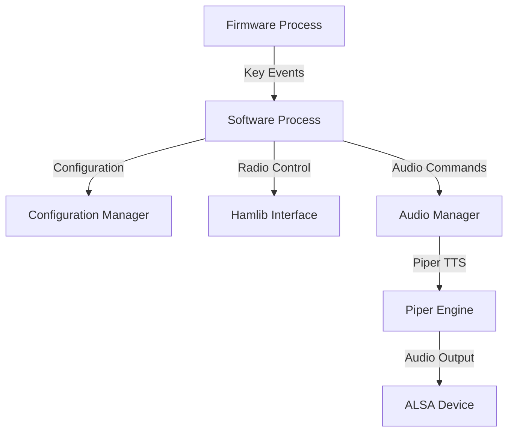

# System Architecture

## Overview
The HAMPOD system is organized into two primary processes that communicate via named pipes:

- **Firmware Process**: Handles low‑level hardware interaction including keypad scanning, audio device enumeration, and Piper TTS invocation.
- **Software Process**: Implements application logic, Hamlib radio communication, configuration parsing, and mode routing.

## Component Diagram

## Data Flow
1. User presses a key on the keypad.
2. Firmware reads the key event and sends it to the Software process via a named pipe.
3. Software processes the event, determines the target mode or action, and interacts with Hamlib to control the radio.
4. Status updates (e.g., frequency readout) are sent back to Firmware for speech synthesis.
5. All audio output passes through the Audio Manager to the Piper TTS engine, which outputs to the selected ALSA device.

## Mode Routing
The `ModeRouting.c` module dynamically loads mode implementations from `libModes.so` and maps keypad sequences to mode functions.

## Configuration Handling
Configuration is read from `Software2/config/hampod.conf` and cached in memory; changes trigger reloads of relevant components.

## Error Handling
- Invalid configuration entries produce spoken and logged error messages.
- Audio device hot‑plug events trigger re‑initialization of the audio pipeline.

---

*This architecture supports extensibility, low‑latency response, and accessibility compliance.*