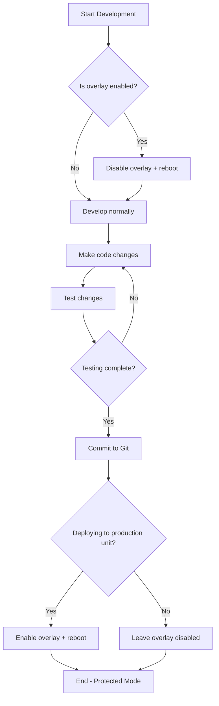

# Startup and Shutdown Protection Plan

This document covers building scripts to:
1. **Auto-start HAMPOD on boot** (`hampod_on_powerup.sh`)
2. **Protect SD card from corruption** (`power_down_protection.sh`)
3. **Provide persistent file write capability** that works in both protected and normal modes

---

## Development Workflow: Feature Branch

All work will be done on a feature branch, then merged to `main` after successful testing.

```bash
# At start of implementation
git checkout -b feature/startup-shutdown-protection

# ... implement and test all changes ...

# After all tests pass
git checkout main
git merge feature/startup-shutdown-protection
git push origin main
git branch -d feature/startup-shutdown-protection
```

---

## SD Card Protection Options Analysis

Your primary criteria are:
1. **Very good protection** against SD card corruption from unexpected power loss
2. **Ease of transition** to/from protected mode

### Option 1: OverlayFS via `raspi-config` (Built-in)

**How it works:** The root filesystem is mounted read-only, with a RAM-based tmpfs layer on top. All writes go to RAM; nothing touches the SD card during normal operation.

| Aspect | Rating |
|--------|--------|
| **Corruption Protection** | ⭐⭐⭐⭐⭐ Excellent - SD card is truly untouched |
| **Ease of Enable/Disable** | ⭐⭐⭐⭐⭐ Single command + reboot |
| **Setup Complexity** | ⭐⭐⭐⭐⭐ Built into Pi OS, no packages needed |
| **RAM Usage** | ⭐⭐⭐⭐ Moderate - only uses RAM for actual changes |
| **Persistent Writes** | ⭐⭐⭐ Requires helper script (remount lower fs) |

**Enable/Disable:**
```bash
# Enable (requires reboot)
sudo raspi-config nonint enable_overlayfs
sudo reboot

# Disable (requires reboot)  
sudo raspi-config nonint disable_overlayfs
sudo reboot
```

### Option 2: fsprotect Package

**How it works:** Debian package that provides overlay functionality similar to raspi-config, but more configurable.

| Aspect | Rating |
|--------|--------|
| **Corruption Protection** | ⭐⭐⭐⭐⭐ Excellent - same as overlayfs |
| **Ease of Enable/Disable** | ⭐⭐⭐ Moderate - edit configs + reboot |
| **Setup Complexity** | ⭐⭐⭐ Requires package install and configuration |
| **RAM Usage** | ⭐⭐⭐⭐ Similar to overlayfs |
| **Persistent Writes** | ⭐⭐⭐ Same complexity as overlayfs |

**Notes:** Less documented for Raspberry Pi; more commonly used on general Debian systems. Adds dependencies.

### Option 3: Full Read-Only Root Filesystem

**How it works:** Mount `/` as `ro` in fstab. Nothing can write to the SD card at all.

| Aspect | Rating |
|--------|--------|
| **Corruption Protection** | ⭐⭐⭐⭐⭐ Maximum - absolute no writes |
| **Ease of Enable/Disable** | ⭐⭐ Difficult - edit fstab + many workarounds |
| **Setup Complexity** | ⭐⭐ High - many apps need modifications to work |
| **RAM Usage** | ⭐⭐⭐⭐⭐ Minimal |
| **Persistent Writes** | ⭐ Very complex - must remount rw explicitly |

**Problem:** Many system services (logging, temp files, etc.) fail without extensive reconfiguration.

### Option 4: Selective tmpfs Mounts

**How it works:** Mount only high-write directories (`/var/log`, `/tmp`, `/var/run`) as tmpfs.

| Aspect | Rating |
|--------|--------|
| **Corruption Protection** | ⭐⭐⭐ Partial - only protects those directories |
| **Ease of Enable/Disable** | ⭐⭐⭐⭐ Edit fstab, usually no reboot needed |
| **Setup Complexity** | ⭐⭐⭐⭐ Simple fstab entries |
| **RAM Usage** | ⭐⭐⭐⭐⭐ Minimal - known sizes |
| **Persistent Writes** | ⭐⭐⭐⭐⭐ Normal writes work everywhere else |

**Problem:** Does NOT protect against corruption during writes to other files. An unexpected power loss during a write to any non-tmpfs file can still corrupt the SD card.

---

## Comparison Summary

| Criteria | raspi-config OverlayFS | fsprotect | Full Read-Only | tmpfs Only |
|----------|:----------------------:|:---------:|:--------------:|:----------:|
| **Corruption Protection** | ⭐⭐⭐⭐⭐ | ⭐⭐⭐⭐⭐ | ⭐⭐⭐⭐⭐ | ⭐⭐⭐ |
| **Ease of Mode Transition** | ⭐⭐⭐⭐⭐ | ⭐⭐⭐ | ⭐⭐ | ⭐⭐⭐⭐ |
| **Setup Simplicity** | ⭐⭐⭐⭐⭐ | ⭐⭐⭐ | ⭐⭐ | ⭐⭐⭐⭐ |
| **No External Dependencies** | ✅ | ❌ | ✅ | ✅ |
| **Works with Pi OS** | ✅ Native | ⚠️ Needs config | ⚠️ Complex | ✅ Native |

---

## Recommendation: raspi-config OverlayFS

**Why this option best meets your criteria:**

1. **Corruption Protection:** ⭐⭐⭐⭐⭐
   - SD card is completely read-only during normal operation
   - Equivalent protection to full read-only, but without the complexity

2. **Ease of Transition:** ⭐⭐⭐⭐⭐
   - Single command to enable or disable
   - No package installation required
   - Built into Raspberry Pi OS
   - Works identically across Pi 3B+, Pi 4, Pi 5, Pi Zero 2 W

3. **Additional Benefits:**
   - Officially supported by Raspberry Pi Foundation
   - Well-documented with large community support
   - Clean reboot to disable (no editing config files)

> [!IMPORTANT]
> **Both fsprotect and raspi-config OverlayFS use the same underlying Linux overlayfs technology.** The difference is implementation simplicity. raspi-config is pre-integrated and requires zero setup beyond running the command.

---

## Part 1: Auto-Start on Boot (`hampod_on_powerup.sh`)

### Approach: systemd Service

The standard, robust way to auto-start applications on modern Raspberry Pi OS is via a **systemd service**. This provides:
- Automatic restart on failure
- Proper startup ordering (waits for network, audio, etc.)
- Easy enable/disable without editing the script
- Logging via `journalctl`

### Script Behavior

```bash
./hampod_on_powerup.sh [--enable|--disable|--status]
```

| Flag | Behavior |
|------|----------|
| `--enable` | Install and enable the systemd service (default if no flag) |
| `--disable` | Disable and remove the systemd service |
| `--status` | Show current auto-start status |

### Implementation Details

1. **Create systemd service file** (`/etc/systemd/system/hampod.service`):

```ini
[Unit]
Description=HAMPOD Ham Radio Accessibility System
After=multi-user.target sound.target

[Service]
Type=forking
User=root
WorkingDirectory=/home/<user>/HAMPOD2026/Firmware
ExecStartPre=/bin/sleep 3
ExecStart=/home/<user>/HAMPOD2026/Documentation/scripts/run_hampod_service.sh
ExecStop=/bin/killall -9 firmware.elf hampod
Restart=on-failure
RestartSec=5

[Install]
WantedBy=multi-user.target
```

2. **Create wrapper script** (`run_hampod_service.sh`) for proper startup/cleanup since `run_hampod.sh` is interactive

3. **Idempotent install**: Script checks if service already exists/enabled before making changes

---

## Part 2: Power-Down Protection (`power_down_protection.sh`)

### Approach: OverlayFS via raspi-config

Raspberry Pi OS includes built-in support for **Overlay File System** which:
- Mounts the root filesystem **read-only**
- Creates a **RAM-based tmpfs layer** for all writes
- Protects the SD card from corruption on unexpected power loss
- Resets to clean state on every reboot

### Script Behavior

```bash
./power_down_protection.sh [--enable|--disable|--status]
```

| Flag | Behavior |
|------|----------|
| `--enable` | Enable overlay filesystem (requires reboot) |
| `--disable` | Disable overlay filesystem (requires reboot) |
| `--status` | Show current protection status |

### Implementation Details

1. **Check current state** by reading `/boot/firmware/overlays/` or `/boot/overlays/` and checking mount status
2. **Use raspi-config non-interactive mode**:
   ```bash
   # Enable overlay and boot protection
   sudo raspi-config nonint enable_overlayfs
   sudo raspi-config nonint enable_bootro
   
   # Disable overlay and boot protection  
   sudo raspi-config nonint disable_bootro
   sudo raspi-config nonint disable_overlayfs
   ```
3. **Offer reboot only if mode changed**

### State Detection

```bash
# Check if overlay is currently active
if grep -q "overlay" /proc/mounts; then
    echo "Overlay is ACTIVE"
fi

# Check if overlay is configured for next boot
if raspi-config nonint get_overlay_now; then
    echo "Overlay will be enabled after reboot"
fi
```

### Terminal Prompt Indicator

The `power_down_protection.sh` script will also configure the bash prompt to show `[RO]` or `[RW]` before the current directory, making it immediately obvious which mode the system is in.

**Example prompts:**
```
[RO] pi@hampod:~ $     # Protected mode - changes lost on reboot
[RW] pi@hampod:~ $     # Normal mode - changes persist
```

**Implementation:** Append to `/home/<user>/.bashrc`:

```bash
# HAMPOD Protection Mode Indicator (color-coded)
hampod_fs_mode() {
    if grep -q " / overlay " /proc/mounts 2>/dev/null; then
        echo -e "\033[0;31m[RO]\033[0m"  # Red - protected, changes lost on reboot
    else
        echo -e "\033[0;32m[RW]\033[0m"  # Green - normal, changes persist
    fi
}
PS1='$(hampod_fs_mode) \u@\h:\w \$ '
```

**Notes:**
- The function runs on every prompt, checking `/proc/mounts` (fast, no disk I/O)
- `[RO]` displays in **red** (warning: changes will be lost)
- `[RW]` displays in **green** (safe: changes persist)
- Script will only add this if not already present (idempotent)

**Plain version (no colors):**
```bash
hampod_fs_mode() {
    if grep -q " / overlay " /proc/mounts 2>/dev/null; then
        echo "[RO]"
    else
        echo "[RW]"
    fi
}
PS1='$(hampod_fs_mode) \u@\h:\w \$ '
```

---

## Part 3: Persistent Configuration Writes

### The Challenge

When overlay filesystem is enabled:
- All file writes go to RAM (tmpfs) and are **lost on reboot**
- HAMPOD needs to save configuration changes (like radio settings, volume levels) permanently

### Solution: Persistent Config Directory with Sync Helper

Create a small persistent partition or use the boot partition for config files, with helper functions that:
1. Detect whether overlay mode is active
2. If active: temporarily remount the lower filesystem as writable, write the file, remount as read-only
3. If not active: write files normally

### Implementation: Shell Helper Script

Create `/usr/local/bin/hampod_persist_write`:

```bash
#!/bin/bash
# Write a file persistently, works in overlay or normal mode
# Usage: hampod_persist_write <source_file> <destination_path>

SOURCE="$1"
DEST="$2"

if grep -q " / overlay " /proc/mounts; then
    # Overlay is active - need to write to lower filesystem
    LOWER_ROOT=$(mount | grep "overlay on / " | sed 's/.*lowerdir=\([^,]*\).*/\1/')
    
    # Temporarily remount boot partition as writable if targeting /boot
    if [[ "$DEST" == /boot/* ]]; then
        sudo mount -o remount,rw /boot
        sudo cp "$SOURCE" "$DEST"
        sudo mount -o remount,ro /boot
    else
        # For other files, write directly to lower filesystem
        sudo mount -o remount,rw "$LOWER_ROOT"
        sudo cp "$SOURCE" "${LOWER_ROOT}${DEST}"
        sudo mount -o remount,ro "$LOWER_ROOT"
    fi
else
    # Normal mode - just copy
    cp "$SOURCE" "$DEST"
fi
```

### C Helper Function for HAMPOD Software

Add to `Software2/src/` a utility function:

```c
// In config.c or a new persistent_storage.c
int persist_config_file(const char* source, const char* dest) {
    char cmd[512];
    snprintf(cmd, sizeof(cmd), "/usr/local/bin/hampod_persist_write '%s' '%s'", source, dest);
    return system(cmd);
}
```

### Alternative: Dedicated Persistent Partition

For a more robust solution, create a separate ext4 partition that remains writable:
1. During setup, create `/dev/mmcblk0p3` as persistent data partition
2. Mount at `/data` or `/var/hampod`
3. Store all config files there
4. This partition is NOT overlaid

> [!NOTE]
> The simpler approach (remounting the lower filesystem) is recommended for initial implementation since it doesn't require repartitioning.

---

## Part 4: Integration with install_hampod.sh

Add to the end of `install_hampod.sh`:

```bash
# Step 8: Configure Power-Up Auto-Start
print_step "Configuring HAMPOD auto-start..."
"$HAMPOD_DIR/Documentation/scripts/hampod_on_powerup.sh" --enable
print_success "HAMPOD will start automatically on boot"

# Step 9: Enable Power-Down Protection
print_step "Enabling SD card protection..."
"$HAMPOD_DIR/Documentation/scripts/power_down_protection.sh" --status

# Offer to enable protection (interactive)
read -p "Enable SD card protection? This helps prevent corruption on power loss. [y/N] " response
if [[ "$response" =~ ^[Yy]$ ]]; then
    "$HAMPOD_DIR/Documentation/scripts/power_down_protection.sh" --enable
fi
```

---

## Part 5: Development Implications Analysis

### Challenges When Working in Protected (Overlay) Mode

| Challenge | Impact | Solution |
|-----------|--------|----------|
| **Code changes lost on reboot** | Can't develop/test iteratively | Disable overlay during development |
| **Git operations fail** | Can't commit or pull changes | Work on remote machine, or disable overlay |
| **apt install fails** | Can't add packages | Disable overlay, install, re-enable |
| **Log files lost** | Can't debug post-reboot issues | Configure rsyslog to remote server, or persist specific logs |
| **Build artifacts lost** | Must rebuild after every reboot | Disable overlay during development |

### Recommended Development Workflow



### Quick Commands for Developers

```bash
# Check current mode
./power_down_protection.sh --status

# Disable for development (requires reboot)
./power_down_protection.sh --disable && sudo reboot

# Re-enable after development (requires reboot)  
./power_down_protection.sh --enable && sudo reboot

# One-liner: Disable, reboot, and SSH back in
./power_down_protection.sh --disable && sudo reboot; # SSH back in after reboot
```

### When to Disable Overlay Mode

| Activity | Overlay Mode |
|----------|--------------|
| Normal HAMPOD operation | ✅ **Enabled** |
| Changing hampod.conf settings | ✅ **Enabled** (uses persist helper) |
| Developing/modifying code | ❌ **Disabled** |
| Installing new packages | ❌ **Disabled** |
| System updates (apt upgrade) | ❌ **Disabled** |
| Debugging boot/startup issues | ❌ **Disabled** |

### Safety Net: Writable /boot Partition

Even with overlay enabled, the `/boot/firmware/` partition (where `config.txt` and `cmdline.txt` live) can be remounted writable for emergency config changes:

```bash
sudo mount -o remount,rw /boot/firmware
# Make changes
sudo mount -o remount,ro /boot/firmware
```

---

## Verification Plan

### Test 1: Auto-Start Script (Manual on Pi)

1. Run `./hampod_on_powerup.sh --enable`
2. Verify with `systemctl status hampod`
3. Reboot the Pi
4. After boot, verify HAMPOD is running: `ps aux | grep -E "firmware.elf|hampod"`
5. Test disable: `./hampod_on_powerup.sh --disable`
6. Reboot and verify HAMPOD does NOT start

### Test 2: Power-Down Protection (Manual on Pi)

1. Run `./power_down_protection.sh --status` (should show disabled initially)
2. Create a test file: `touch /tmp/test_overlay.txt`
3. Run `./power_down_protection.sh --enable` and reboot
4. After reboot, check status: `./power_down_protection.sh --status` (should show enabled)
5. Create another test file: `touch /tmp/test_after_overlay.txt`
6. Reboot again
7. Verify `/tmp/test_after_overlay.txt` is **gone** (proves overlay working)
8. Run `./power_down_protection.sh --disable` and reboot
9. Create test file, reboot, verify it **persists**

### Test 3: Persistent Config Write (Manual on Pi)

1. Enable overlay mode
2. Create a test file: `echo "test" > /tmp/persist_test.txt`
3. Use persist helper: `hampod_persist_write /tmp/persist_test.txt /home/pi/test_persist.txt`
4. Reboot
5. Verify `/home/pi/test_persist.txt` exists after reboot

### Test 4: Idempotence (Script Safety)

1. Run `./hampod_on_powerup.sh --enable` twice in a row (should not error)
2. Run `./power_down_protection.sh --enable` on already-enabled system (should show status, not error)
3. Run both scripts with invalid flags (should show help, not crash)

---

## Files to Create

| File | Description |
|------|-------------|
| `Documentation/scripts/hampod_on_powerup.sh` | Auto-start management script |
| `Documentation/scripts/power_down_protection.sh` | Overlay filesystem management script |
| `Documentation/scripts/run_hampod_service.sh` | Non-interactive wrapper for systemd |
| `/usr/local/bin/hampod_persist_write` | Installed by protection script; persistent file helper |
| `~/.bashrc` (modified) | Adds `[RO]`/`[RW]` prompt indicator |

---

## Risk Assessment

| Risk | Mitigation |
|------|------------|
| raspi-config command syntax differs between OS versions | Check for existence of commands, fall back to manual config |
| Overlay prevents all system updates | Clear documentation + easy disable command |
| Users forget they enabled overlay and lose work | Print clear warnings, status in login MOTD |
| Boot partition full prevents config saves | Monitor space, warn if < 10MB free |

---

## Summary

This plan provides:
1. ✅ **hampod_on_powerup.sh** - Reliable auto-start via systemd
2. ✅ **power_down_protection.sh** - SD card protection via overlayfs  
3. ✅ **Persistent write capability** - Works in both modes
4. ✅ **Development workflow** - Clear guidance for when to disable protection
5. ✅ **install_hampod.sh integration** - Runs both scripts during setup
