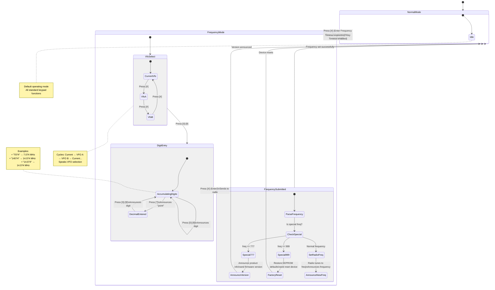
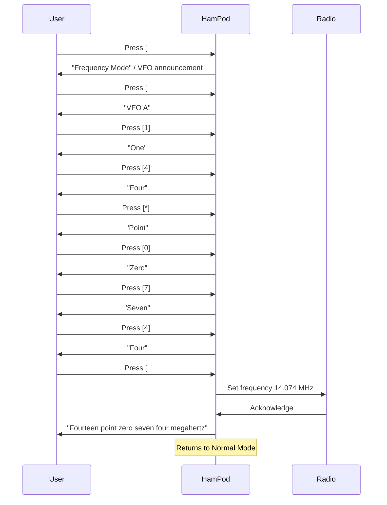
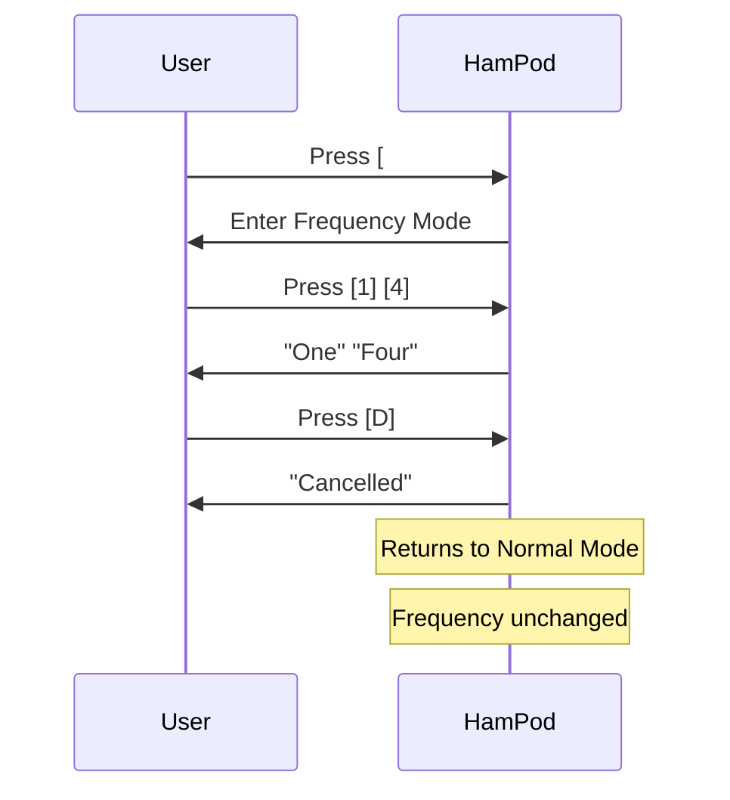

# Frequency Mode User Interactions

This document contains a Mermaid state diagram representing the user interactions in Frequency Mode for the HAMPOD device.

**Reference:** ICOMReader_Manual_v106.txt, Section 2 (Frequency Entry Mode)

---

## State Diagram

---

## Detailed Key Mappings in Frequency Mode

| Key | Action | Behavior |
|-----|--------|----------|
| `[0]`-`[9]` | Digit entry | Appends digit to frequency buffer, announces digit |
| `[*]` | Decimal point | First press: inserts decimal, announces "point" |
| `[*]` (second) | Cancel | Second decimal clears entry, exits to Normal Mode |
| `[#]` | Enter/VFO cycle | Before digits: cycles VFO selection (A→B→Current) |
| `[#]` | Submit | After digits: sends frequency to radio |
| `[D]` | Clear | Clears entry, announces "Cancelled", exits to Normal Mode |

---

## Special Frequencies

| Input | Effect |
|-------|--------|
| `777` + `[#]` | Announces product information and firmware version |
| `999` + `[#]` | Restores EEPROM to factory defaults and resets device |

---

## Timeout Behavior

If the **Key Timeout** option is enabled in configuration (5-30 seconds):
- Partial frequency entry will be cleared after timeout
- HamPod returns to Normal Mode
- Announces timeout notification

---

## Auto-Decimal Feature

For convenience, the HAMPOD can auto-insert the decimal point for 4-5 digit entries:

| Input Digits | Resulting Frequency |
|--------------|---------------------|
| `7074` | 7.074 MHz |
| `14074` | 14.074 MHz |
| `21200` | 21.200 MHz |
| `28400` | 28.400 MHz |

**Note:** The original ICOMManual describes explicit decimal entry, but auto-decimal is a convenience feature in the HAMPOD implementation.

---

## Sequence Diagram: Typical Frequency Entry

---

## Sequence Diagram: Cancel Frequency Entry

